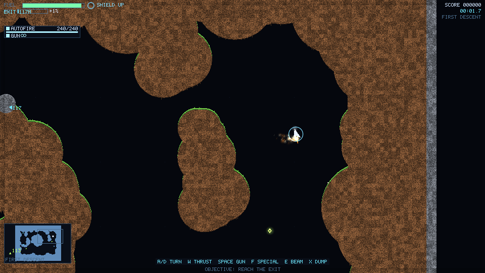
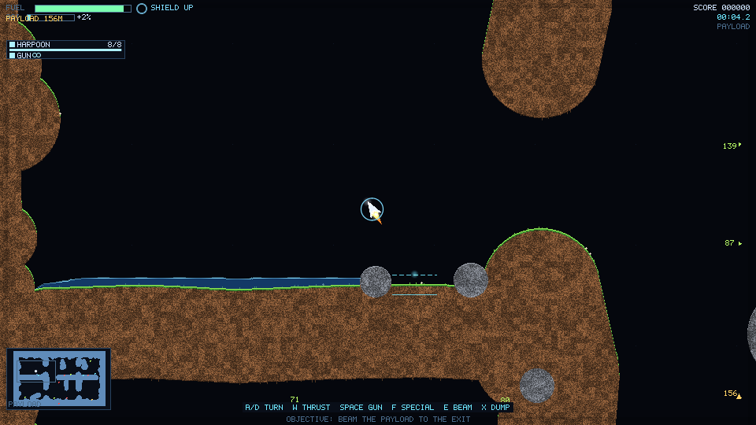
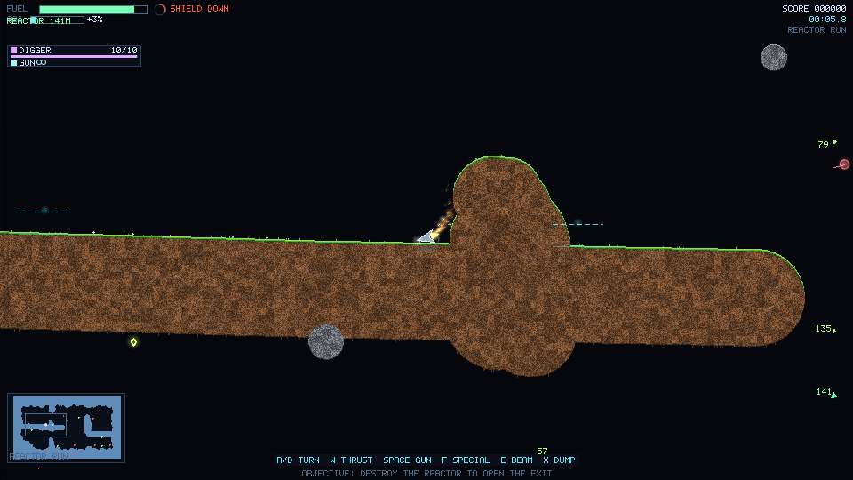

# luola

> [!WARNING]
> **This entire repository is LLM-generated.** Every line of code, every level,
> every document and this README were written by **DeepSeek V4.1 Flash**. It is
> not a product, it has had no security review, and it may be wrong in ways the
> tests do not catch. Read it as a benchmark artifact, not as trustworthy
> software. It is a test how well it can write a full game. This was about 4 euros
> in token costs, spread to four days of generating and testing.

A cave flyer — *luolalentely*, gravity shooter, Thrust-type — written from
scratch in Rust. Two-dimensional, side view, gravity always down, one fragile
ship, three levels, and no assets at all: every pixel is rasterized and every
sound is synthesized at runtime.

```
cargo run --release
```

## Screenshots

Real frames from the game's own software renderer, written straight to PNG with
`--screenshot` on a machine with no display. HUD, radar, particles and terrain
are all rasterized by the same code that draws the window.

**Level 1 — First Descent.** The ship under thrust in the opening cave, objective
"reach the exit" on the status line.



**Level 2 — Payload.** Harpoon loaded, the payload rod resting in the water it has
to be towed out of.



**Level 3 — Reactor Run.** Digging towards the reactor with the shield down, one
of five turrets in range.



## What this is

A small but complete game in the Finnish cave-flyer tradition (Turboraketti,
AUTS, Wings, Gravity Force 2):

- **Three-level campaign** with briefing cards, an itemised results screen,
  in-game help and a pause menu.
- **Classic and modern control schemes**, switchable at runtime with `C`.
- **Deterministic 120 Hz simulation** with input-log replays that verify
  themselves against a checksum.
- **Destructible terrain** — dirt and granular walls dig; rock does not — plus
  water that falls, spreads and levels out, moving gates and crushers, turrets,
  drones, mines, reactors, hidden exits and a signal graph.
- **33 special weapons** from the era's `WEAPONS.DAT` rosters, one mounted at a
  time beside the always-available gun, chosen on each level's briefing card and
  re-armed at landing pads.
- **Headless modes** for validation, scripted simulation, replay verification,
  whole-level map renders and offscreen PNG screenshots.

The stack is four crates and no engine: `winit` (window), `softbuffer` (CPU
present), `cpal` (audio), `serde`/`toml` (data). No GPU API, no C or C++ core, no
image or sound files.

## This repo is also a benchmark

The point of this repository is to test how well **DeepSeek V4.1 Flash** can
write a game. Every line of Rust here — simulation, renderer, software font,
synthesizer, level format, tests, documentation — was written by the model from
the human's direction, in this working tree. The human chose the genre, the
feature list, reviewed the code and flew it; the model did the engineering.

The task was set to be *verifiable* rather than merely plausible, which is why
the repository is shaped the way it is:

- **No assets to hide behind.** There is nothing to download and nothing to copy:
  the ship, terrain texture, particles, 5×7 bitmap font and all audio are
  generated by code. Nothing can be attributed to a borrowed sprite or sample.
- **The model can check its own work.** The headless modes are the grading hook:
  a level can be validated for seal and reachability, a scripted run can be
  simulated and printed, a replay can be re-simulated and its checksum compared,
  and a frame can be rendered to PNG without a display. Every screen is
  reproducible on a machine with no window.
- **The code is meant to be read.** `docs/design.md` explains what the code
  actually does and why each decision was made, level by level and system by
  system; `docs/game_mechanics.md` is the sourced genre reference it was built
  against. The prose is part of the deliverable.

How to judge the result:

```sh
cargo test                    # 112 tests: determinism, collision, feel, missions
cargo run --release           # then fly it
cargo run --release -- --validate levels/*.toml
```

## Requirements

- Rust with **edition 2024** support (Rust 1.85 or newer).
- Linux: X11 or Wayland development libraries plus ALSA (`alsa-lib`), which
  `winit`/`softbuffer`/`cpal` link against. macOS and Windows need no extra
  packages.
- A display and an audio device are needed to *play*; every headless mode below
  runs without either.

## Build and run

Run from the repository root — the campaign is loaded from `levels/` relative to
the working directory.

```sh
cargo run --release                      # play the campaign from level 1
cargo run --release -- --level levels/03_reactor_run.toml
cargo run --release -- --index 1         # start at campaign level 2
cargo run --release -- --scheme modern   # twin-stick-ish scheme
cargo run --release -- --mute            # no audio
```

## How to play

**Goal.** Fly the ship to the exit without touching the cave. Terrain contact is
lethal; the shield absorbs exactly one hit and then needs a moment. Level 2
requires the payload: beam it, tow it and bring it into the exit. Level 3
requires killing the reactor first — which opens the exit and starts the
collapse timer — and leaving before it runs out.

**Flying.** Gravity is always on and only thrust fights it. There is no drag and
no speed limit, so the skill is planning your attitude: rotation sets the spin,
and thrust always fires along the hull. Thrust burns fuel; a dry tank kills the
engines *and* the shield. Land slowly on a pad to refuel, reset the shield and
re-arm your special.

**Terrain.** Dirt opens on the first hit, so you can dig tunnels and shortcuts.
A granular wall is tough — it takes several hits and grabs a slow ship that
touches it, holding you until you shoot the wall away around your hull. Rock is
permanent. Water is cover: it stops bullets and drags you down.

**Weapons.** The gun never runs out. Your special is a second trigger, picked on the
briefing card before each level starts and re-armed at landing pads. `X` jettisons
the magazine: you lose the ammo and fly measurably lighter and quicker — land again
to get it back.

| Action | Classic (default) | Modern |
|---|---|---|
| Rotate | `A`/`D` or `←`/`→` | — (the hull follows the aim) |
| Thrust / move | `W`, `↑`, `Shift` | `WASD` in the stick direction |
| Fire the gun | `Space` | left mouse or `Space` |
| Fire the special | `F` | `F` |
| Beam | `E` (hold) | right mouse or `E` |
| Choose / change weapon | `A`/`D` or `←`/`→`, on the briefing card or parked on a pad | `A`/`D`, on the briefing card or parked on a pad |
| Jettison the magazine | `X` | `X` |

`P` pause, `R` restart, `C` switch scheme, `F1` record a replay, `H`/`F2` help,
`Esc` menu.

## Command line

```
luola [OPTIONS]                      play the campaign
luola --validate <level.toml>...     check levels load, are sealed and reachable
luola --headless [OPTIONS]           simulate without a window and print a report
luola --screenshot OUT.png [OPTIONS] render frames offscreen to PNG
luola --map OUT.png [OPTIONS]        draw the whole level top-down (a design aid)
luola --list-levels                  show the campaign paths
luola --weapons                      list the 33 specials and their numbers
```

`--level`, `--index`, `--scheme`, `--weapon`, `--seed`, `--script`
(`idle`/`wobble`/`dervish`), `--ticks`, `--replay`, `--record`, `--trace`,
`--shots`, `--size`, `--no-hud`, `--mute`. Full text: `luola --help`.

## Verification

```sh
cargo test                                        # the whole suite

cargo run --release -- --validate levels/*.toml    # sealed, reachable, fuel budget

# Determinism: record a run, then re-simulate and compare the checksum.
cargo run --release -- --headless --ticks 600 --record /tmp/run.replay
cargo run --release -- --replay /tmp/run.replay --headless

cargo run --release -- --headless --script dervish --ticks 1800 --trace
cargo run --release -- --screenshot /tmp/shot.png --shots 3 --size 640x360
cargo run --release -- --map /tmp/level.png --level levels/01_first_descent.toml
```

`cargo test` runs 112 tests across five integration binaries (`cli`, `flow`,
`presentation`, `simulation`, `weapons`) and the library's unit tests. They defend
determinism, swept collision at speed, terrain and water carving, the shield's
frame-level timing, the mass economy, the payload rod, gates and the signal
graph, the shipped levels, the shell's screen flow, and that every screen draws
real pixels.

## Layout

| Path | What is in it |
|---|---|
| `src/sim/` | The simulation: fixed 120 Hz step, no rendering, no I/O, no clock. |
| `src/render/` | The software renderer: framebuffer, bitmap font, scene, HUD, particles, palette. |
| `src/audio/` | The synthesizer: engine, weapons, explosions, klaxon — all generated sample by sample. |
| `levels/` | The campaign as TOML. |
| `tests/` | Behaviour tests for the simulation, renderer, shell and CLI. |
| `docs/screenshots/` | Offscreen PNG frames from `--screenshot`, used in this README. |
| `docs/design.md` | How the code works and why, system by system, with measurements. |
| `docs/game_mechanics.md` | The sourced genre reference the game was built against. |
| `docs/finnish_cave_flyer_weapons.md` | The era's `WEAPONS.DAT` rosters and what this game took from them. |

## Deliberately not implemented

Listed so the scope is explicit: multiplayer of any kind, a level editor,
collapsing terrain (dirt holds its shape when undermined), water pressure, gamepad
support and lives. `docs/design.md` §12 gives the reasoning for each.
